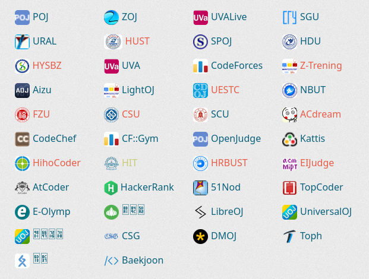

# strangers
This is a competitive programming team called strangers

## Repository Structure
- Root of the repository you can see many directories like books, beginners, mathematics, strings, graphs etc.
- Each of these directories have 3 sub directories. easy, medium and hard.
- Inside each directory you will find a directory which represents the problem name
- Inside the problem directory you will find a README.md file where we will instruct you how to solve the problem. Steps for solving the problem.
- And this same directory you will find a lot of files. Where every competitive programmers submitted their code.
- Others directories like medium and hard is 100% same as easy directory structure.

## Rules
- We will provide a task per day.
- You need to submit your task within 24 hours.
- If you are inactive for 3 days then you will be disqualified for some days.
- If you can't solve the task then try again and again.
- If you failed a lot of time then open the problems directory and see how other members solved this.
- After all of those process if you can't understand the steps then we will arrange a google meet.
- Whenever you upload a file you need to follow this structure
  
  - `<last 3 digits of your student id>.<your github username>.<probelm name using camel case format with file extension>`
  - `063.mdmarufsarker.helloWorld.cpp`

## Required skills
- [C](https://youtube.com/playlist?list=PLgH5QX0i9K3pCMBZcul1fta6UivHDbXvz) / [C++](https://youtube.com/playlist?list=PLgH5QX0i9K3q0ZKeXtF--CZ0PdH1sSbYL) / [Python](https://youtube.com/playlist?list=PLgH5QX0i9K3rz5XqMsTk41_j15_6682BN) / [Java](https://youtube.com/playlist?list=PLgH5QX0i9K3oAZUB2QXR-dZac0c9HNyRa)
- [Command Line Basic](https://youtube.com/playlist?list=PLCWi-JUKQh2-YQ6U_dqQix3s00tIkgeKJ)
- [Git and Github](https://youtu.be/oe21Nlq8GS4)

## List of all online judge

## Our Contributors

## License
MIT License

Copyright (c) 2022 strangers-bd

Permission is hereby granted, free of charge, to any person obtaining a copy
of this software and associated documentation files (the "Software"), to deal
in the Software without restriction, including without limitation the rights
to use, copy, modify, merge, publish, distribute, sublicense, and/or sell
copies of the Software, and to permit persons to whom the Software is
furnished to do so, subject to the following conditions:

The above copyright notice and this permission notice shall be included in all
copies or substantial portions of the Software.

THE SOFTWARE IS PROVIDED "AS IS", WITHOUT WARRANTY OF ANY KIND, EXPRESS OR
IMPLIED, INCLUDING BUT NOT LIMITED TO THE WARRANTIES OF MERCHANTABILITY,
FITNESS FOR A PARTICULAR PURPOSE AND NONINFRINGEMENT. IN NO EVENT SHALL THE
AUTHORS OR COPYRIGHT HOLDERS BE LIABLE FOR ANY CLAIM, DAMAGES OR OTHER
LIABILITY, WHETHER IN AN ACTION OF CONTRACT, TORT OR OTHERWISE, ARISING FROM,
OUT OF OR IN CONNECTION WITH THE SOFTWARE OR THE USE OR OTHER DEALINGS IN THE
SOFTWARE.
