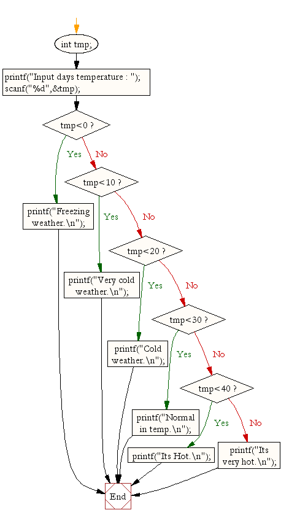

# Title

Write a C program to read temperature in centigrade and display a suitable message according to temperature state below.

## Description

- Note: data type is float. Don't be confused by seeing the flowchart
- 

- Input

  - Input type must be float.

- Output
  - Temp < 0 then Freezing weather
  - Temp 0-10 then Very Cold weather
  - Temp 10-20 then Cold weather
  - Temp 20-30 then Normal in Temp
  - Temp 30-40 then Its Hot
  - Temp >=40 then Its Very Hot

- Test Cases

|Input|Output|
|-----|------|
|42.5|Its very hot.|
|14.9|Cold weather.|
|-10.7|Freezing weather.|
