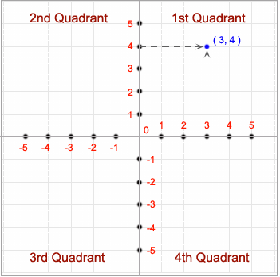

# Title

Find the quadrant in which the coordinate point lies

## Description

Write a program to accept a coordinate point in a XY coordinate system and determine in which quadrant the coordinate point lies.

- Logic

- Test Cases

| Input                                           | Output                                                     |
| ----------------------------------------------- | ---------------------------------------------------------- |
| Input the values for X and Y coordinate : 7 9   | The coordinate point (7,9) lies in the First quandrant.    |
| Input the values for X and Y coordinate : -8 -4 | The coordinate point (-8, -4) lies in the Third quandrant. |
| Input the values for X and Y coordinate : 0 0   | The coordinate point (0,0) lies at the origin.             |
