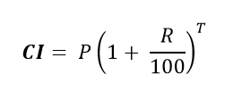

# Title
Find Compound Interest

## Description
Write a  program to input principle (amount), time and rate (P, T, R) and find Compound Interest. 
How to calculate compound interest?.Logic to calculate compound interest.

- Logic

  - follow the formula to calculate compound interest.
  - input principle amount. Store it in some variable say principle.
  - Input time in some variable say time.
  - Input rate in some variable say rate.
  

Where,
P is principle amount,
R is the rate and
T is the time span.

- Formula to calculate compound interest annually is given by.

- Test Cases

|Input|Output|
|-----|------|
|Enter principle (amount): 1200||
|Enter time:2||
|Enter rate:5.4|Compound Interest = 1333.099243|
